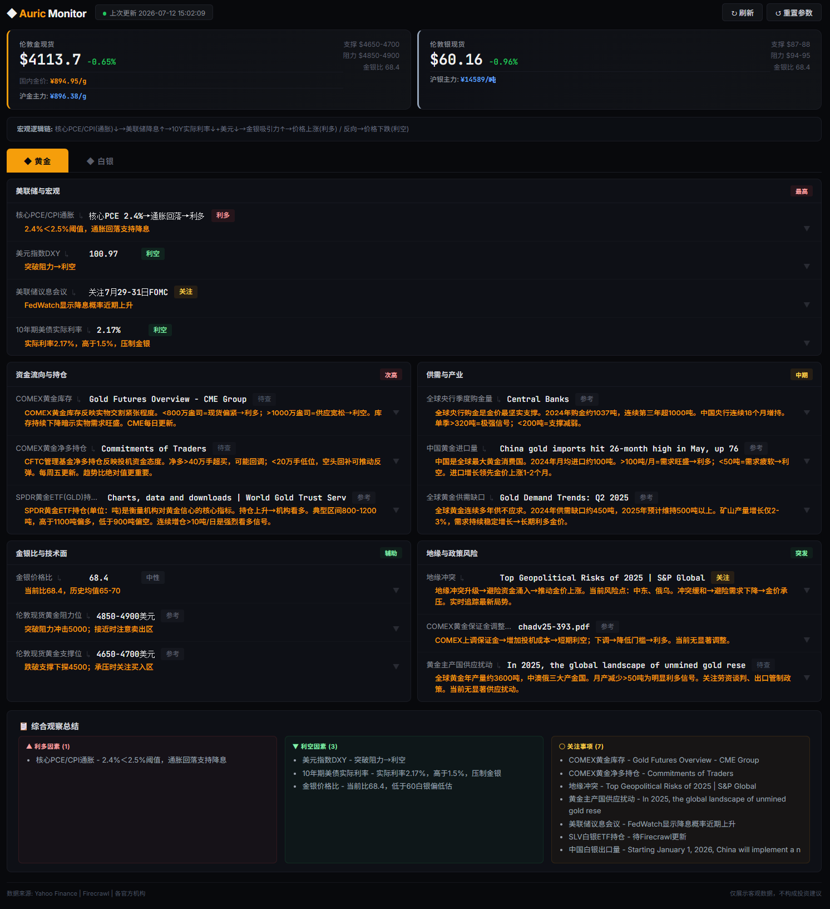

# Auric Monitor

 — 黄金白银宏观监测系统

[](LICENSE)
[](https://www.python.org/downloads/)
[](https://flask.palletsprojects.com/)

> 实时监测影响黄金和白银价格的核心宏观指标，覆盖美联储政策、资金流向、供需产业、金银比价和地缘风险五大维度。

---

## 功能特性

| 维度 | 指标 | 数据源 |
|------|------|--------|
| 美联储与宏观 | 议息会议、核心PCE、美元指数DXY、10Y美债实际利率 | Yahoo Finance |
| 资金流向与持仓 | SPDR GLD持仓、SLV持仓、COMEX净多/库存 | Firecrawl + CME/CFTC |
| 供需与产业 | 全球供需缺口、央行购金量、中国进出口、光伏用银 | Firecrawl + WGC/IEA |
| 金银比与技术面 | 金银价格比、伦敦金/银支撑阻力位 | Yahoo Finance |
| 地缘与政策风险 | 主产国供应扰动、地缘冲突、保证金调整 | Firecrawl 新闻搜索 |

### 核心亮点

- **双金属看板** — 黄金/白银独立标签页，分开展示各自的关键指标
- **系统分析** — 每条指标配套阈值判断、影响解读和监测频率说明
- **宏观逻辑链** — 展示通胀→利率→美元→金价的传导关系
- **综合总结** — 自动汇总当前利多/利空因素，辅助决策判断
- **国内价格** — 伦敦金/银 + 国内金价 + 沪金/沪银主力

---

## 快速开始

### 环境要求

- Python 3.10+
- Firecrawl API Key（[免费注册](https://www.firecrawl.dev/)）

### 安装与运行

```bash
# 克隆仓库
git clone https://github.com/YOUR_USER/gold-silver-analysis.git
cd gold-silver-analysis

# 安装依赖
pip install -r backend/requirements.txt

# 配置 Firecrawl API Key
cp .env.example .env
# 编辑 .env 填入 FIRECRAWL_API_KEY

# 启动服务
python run.py

# 打开浏览器
open http://localhost:5100
```

### 使用说明

1. 首次启动后，服务会通过 Firecrawl 自动搜索各指标的最新数据
2. 搜索完成后，看板将展示所有指标的状态
3. 点击指标右侧 **▼** 展开详情，查看阈值、解读和系统分析
4. 点击数据源链接图标 **↳** 跳转至权威数据源
5. 支持手动刷新（右上角按钮）和重置判断参数

---

## 项目结构

```
gold-silver-analysis/
├── backend/                    # Python 数据引擎
│   ├── analysis_text.py        # 指标分析文本
│   ├── app.py                  # Flask Web 服务
│   ├── config.py               # 配置与指标定义
│   ├── data_sources.py         # 数据抓取逻辑
│   └── firecrawl_helper.py     # Firecrawl 集成
├── frontend/                   # Web 前端
│   ├── index.html              # 主看板页面
│   ├── style.css               # 深色主题样式
│   └── app.js                  # 数据渲染与交互
├── .env.example                # 环境变量模板
├── .gitignore
├── LICENSE
├── run.py                      # 启动入口
└── README.md
```

---

## 技术栈

| 层级 | 技术 |
|------|------|
| 后端 | Python 3.12, Flask, Requests, concurrent.futures |
| 数据源 | Yahoo Finance API, Firecrawl API |
| 前端 | 原生 JavaScript, CSS Grid/Flexbox, Google Fonts |
| 分析 | 实时数据 + 专家规则引擎（阈值判断 + 多因子评分） |

---

## 数据源说明

| 数据 | 来源 | 更新频率 |
|------|------|----------|
| 伦敦金/银价格 | Yahoo Finance (GC=F, SI=F) | 实时 |
| 美元指数 DXY | Yahoo Finance (DX-Y.NYB) | 实时 |
| 10Y 美债实际利率 | Yahoo Finance (^TNX) | 每日 |
| 人民币汇率 | Yahoo Finance (CNY=X) | 实时 |
| 沪金/沪银主力 | 新浪财经 (nf_AU0, nf_AG0) | 每日 |
| GLD/SLV ETF 持仓 | Firecrawl（SPDR/iShares 官网） | 每日 |
| COMEX 库存/持仓 | Firecrawl（CME/CFTC 官网） | 每周 |
| 供需/宏观数据 | Firecrawl（WGC/IEA/海关） | 月度/季度 |
| 地缘/新闻 | Firecrawl 新闻搜索 | 实时 |

---

## License

[MIT License](LICENSE) © 2026 Auric Monitor

仅展示客观数据，不构成投资建议。